# Life OS for Kids
## System Design Specification

**Document status:** Product + Domain Design frozen at **V0.4**, pending System Architecture V1.0.  
**Scope:** Ages 6-17, with initial family pilot focused on ages 7 and 11.  
**Primary goal:** Build a system that helps children become progressively more responsible, independent, financially aware, family-oriented, reflective, and capable of managing real life without becoming dependent on the app or on rewards.

> **North Star:** The system succeeds when it gradually becomes less necessary.

---

# Table of Contents

1. [Design Constitution](#1-design-constitution)
2. [Version Map](#2-version-map)
3. [V0.1 - Core Domain Model](#3-v01---core-domain-model)
4. [V0.2 - Detailed Business Rules & Flows](#4-v02---detailed-business-rules--flows)
5. [V0.3 - Use Cases, Permissions & MVP Boundary](#5-v03---use-cases-permissions--mvp-boundary)
6. [V0.4 - State, Edge Cases & Failure Modes](#6-v04---state-edge-cases--failure-modes)
7. [Consolidated Domain Invariants](#7-consolidated-domain-invariants)
8. [MVP Scope](#8-mvp-scope)
9. [Open Decisions for System Architecture V1.0](#9-open-decisions-for-system-architecture-v10)
10. [References](#10-references)

---

# 1. Design Constitution

The system is not a chore tracker. It is a small, age-adaptive model of real life. It distinguishes responsibility, growth, family contribution, economic work, values, faith, reflection, and autonomy so that one mechanic does not distort the meaning of another.

## 1.1 Core principles

1. **The system should gradually make itself less necessary.** Support should move from external reminders and rewards toward habits, identity, self-management, and independence.
2. **Every meaningful action should leave a visible trace.** The trace may be progress, growth, impact, a milestone, a visual-world change, or a meaningful Moment; it does not have to be XP.
3. **Progress is universal; XP is selective.** Most important areas can show progress, but XP is primarily for effort, learning, mastery, and challenge.
4. **Money represents economic value, not good behavior.** Money belongs to paid work, allowance, gifts, spending, saving, and giving - not brushing teeth, respecting parents, prayer, or normal family contribution.
5. **Different behaviors require different visual languages.** Goals use journeys/bars; habits use consistency and growth; skills use levels; independence uses autonomy indicators; values use Moments/stories; family contribution changes a shared world.
6. **Responsibilities are not transactions.** Self-care and ordinary family contribution are part of belonging to a family, not a continuous parent-child marketplace.
7. **Character is recognized, never scored.** There is no numeric kindness, honesty, faith, or morality score.
8. **Intrinsic areas should never become an economy.** Love, compassion, honesty, generosity, worship, and family care are not redeemable currencies.
9. **Rewards support motivation and then retreat.** They may scaffold a new behavior, but they should fade as the behavior becomes internalized.
10. **Autonomy grows with responsibility.** The child gains real choices as demonstrated readiness increases.
11. **No sibling leaderboard.** The primary comparison is the child's present self versus their past self; family features emphasize collaboration.
12. **Failure is data, not debt.** Mistakes produce learning, repair, logical consequences, or plan changes - not a points debt.
13. **Reward the process more than the outcome.** Effort, planning, persistence, recovery, and return after difficulty matter.
14. **The child should understand why.** Important activities and rules should carry an age-appropriate explanation of their meaning.
15. **The system adapts to age, maturity, and preference.** The same domain can have different presentations and defaults.
16. **Parents use analytics to understand, not judge.** Analytics describe behavior and trends, not personality or worth.
17. **Real life remains outside the screen.** The app organizes and reflects life; it does not replace conversation, affection, family rituals, real consequences, or real giving.
18. **Every mechanic must answer: what are we teaching?** If a feature has no meaningful learning purpose, it should not be added merely because it is engaging.
19. **Every configurable choice should have a sensible default.** Start quickly; customize later.
20. **Age determines defaults, not capability.** Demonstrated readiness and family judgment matter more than a birthday alone.
21. **Autonomy is suggested by the system but granted by the parent/guardian.** Important authority transfers are never silent algorithmic decisions.
22. **Graduation removes active gamification, not historical visibility.** Graduated routines remain visible to guardians for lightweight monitoring and possible regression support.
23. **Visualization intensity is customizable and independent from business logic.** Presentation changes cannot alter XP, money, progress, history, or permissions.

## 1.2 Reward semantics

| Domain | Visible progress | XP | Money | Primary representation |
|---|---:|---:|---:|---|
| Self responsibility | Yes | Training-only / temporary | No | Independence / habit growth |
| Family responsibility | Yes | Usually no | No | Family-world contribution |
| Learning & skills | Yes | Yes | Normally no | Skill tree / journey |
| Extra work | Yes | Usually no | Yes | Job / wallet |
| Long-term goal | Yes | Optional | No by itself | Goal journey |
| Kindness / values | Yes | No | No | Moment / story / world change |
| Faith | Yes, carefully | No | No | Journey / reflection |
| Achievement | Yes | Optional skill bonus | Optional separate celebration | Milestone |
| Saving | Yes | No | Money itself | Saving-goal meter |
| Giving / sadaqah | Yes | No | Money leaves wallet | Giving history / reflection |

**Rule:** An action may have several downstream effects, but it should have **one primary semantic meaning**. The system must not inflate one event into five unrelated currencies.

---

# 2. Version Map

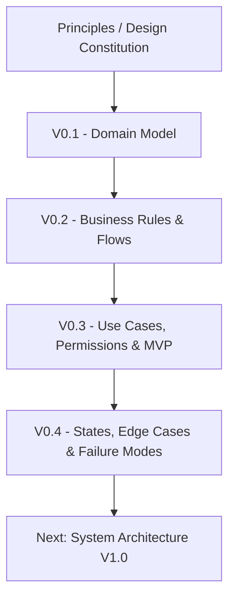

*Figure: Design evolution from principles through V0.4 and into architecture*

| Version | Focus | Main outcome |
|---|---|---|
| V0.1 | Core domain model | Define the real-world concepts and keep meaning separate from visualization |
| V0.2 | Business rules & flows | Define completion, reminders, recovery, autonomy, graduation, XP, goals, jobs, money, values, reviews, analytics |
| V0.3 | Use cases, permissions & MVP | Define actors, authorization, templates/defaults, screens, commands/events, MVP scope and acceptance criteria |
| V0.4 | States, edge cases & failure modes | Define uncertainty, corrections, offline sync, conflicts, partial jobs, external money actions, age transitions, non-use, rewards, and historical integrity |

---

# 3. V0.1 - Core Domain Model

## 3.1 What the system models

The system models six connected outcomes:

- **Responsibility -> Independence**
- **Growth -> Competence**
- **Family -> Belonging**
- **Work -> Money**
- **Values -> Identity**
- **Reflection -> Self-awareness**

A single `Task -> Points` model is deliberately rejected because it would collapse very different meanings into one reward mechanism.

## 3.2 Actors

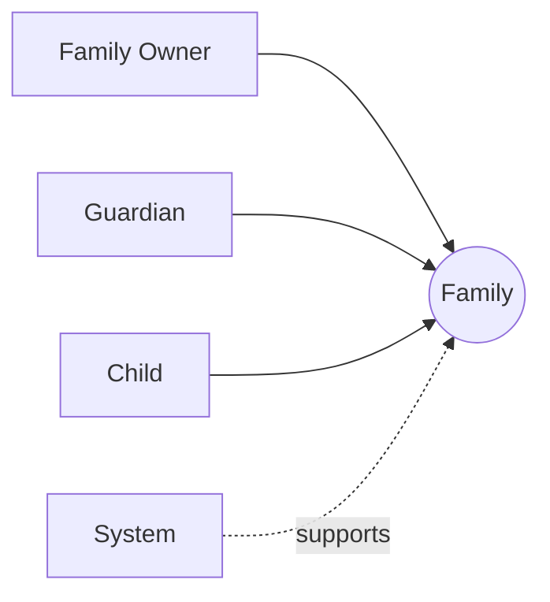

*Figure: Primary actors: Family Owner, Guardian, Child, and the supporting System*

- **Family Owner:** creates the family and can manage guardians and family-level configuration.
- **Guardian:** manages child-related parenting features, reviews evidence, approves jobs/autonomy/graduation, and sees guardian analytics.
- **Child:** interacts with their own activities, goals, money, story, and family-shared features according to autonomy and permissions.
- **System:** schedules instances, calculates derived progress, detects recovery, creates explainable suggestions, and maps semantic events to visuals.

## 3.3 Core domain relationships

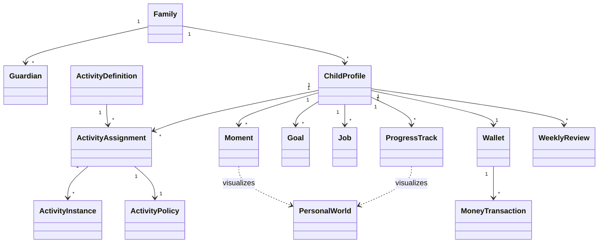

*Figure: Simplified consolidated core domain model*

### Why ActivityDefinition, Assignment, and Instance are separate

An activity definition describes **what the thing is**. An assignment describes **how it applies to this child**. An instance represents **one real opportunity in time**.

Example:

- Definition: `Make bed`
- Eyad assignment: every morning, independence progress, temporary training XP, no money
- Today's instance: available 06:00, target 07:30, opportunity ends 10:00

This makes historical analytics reliable and allows two children to share a conceptual activity while having different schedules, expectations, and progress stages.

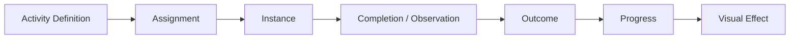

*Figure: From reusable definition to real-life outcome and visible impact*

## 3.4 Activity categories

Initial categories:

1. **Self Responsibility** - care for self, belongings, routines, and personal environment.
2. **Family Responsibility** - ordinary contribution to family life.
3. **Growth** - learning, training, practice, skill development.
4. **Extra Work** - optional work that can legitimately create income.
5. **Values** - meaningful acts of kindness, honesty, courage, generosity, initiative, perseverance, and related identity signals.
6. **Faith** - religious practice and spiritual development, without turning worship into XP or money.
7. **Shared Family Goal** - a common outcome to which family members contribute differently.

The category is not merely a label. It constrains what reward and progress mechanisms are permitted.

## 3.5 Policy Engine

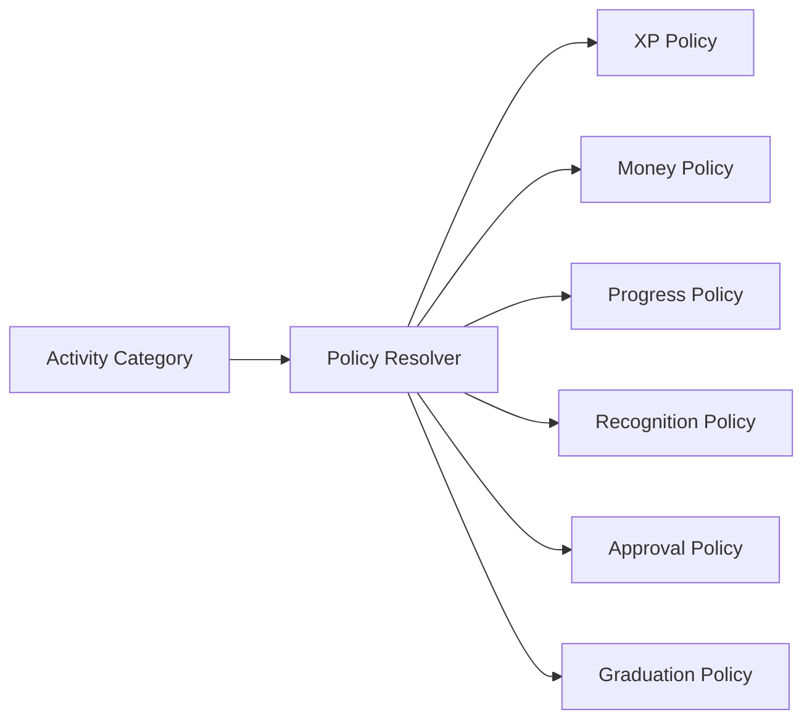

*Figure: Category-driven policy engine*

Example policy outcomes:

- **Faith:** money forbidden; XP forbidden; age-appropriate journey/reflection allowed.
- **Values:** money forbidden; XP forbidden; Moment/story recognition allowed.
- **Growth:** XP allowed; money normally forbidden; mastery progress allowed.
- **Extra Work:** money allowed; parent approval required; general XP normally unnecessary.
- **Self Responsibility:** independence progress; temporary training XP possible; money forbidden.

The Policy Engine protects the design constitution even when a parent customizes defaults.

## 3.6 Progress types

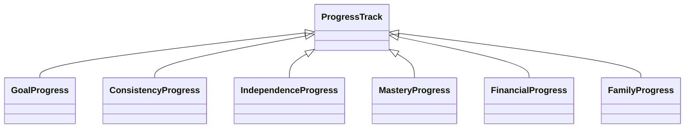

*Figure: Different progress types for different meanings*

- **Goal progress:** current versus target.
- **Consistency progress:** how regularly an activity occurs.
- **Independence progress:** self-initiation, reminders, and support needs.
- **Mastery progress:** skill XP, level, milestone.
- **Financial progress:** saving toward goals and allocation behavior.
- **Family progress:** shared outcome and contribution events without sibling ranking.

This resolves the important distinction: **everything meaningful can create progress, but not everything should create XP.**

## 3.7 Visual representation layer

The domain stores meaning; the UI chooses how to render that meaning.

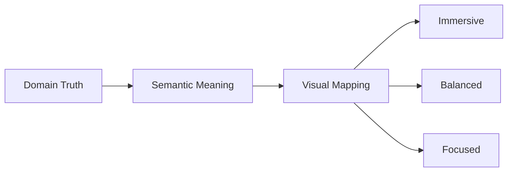

*Figure: Domain truth is interpreted before it is visualized*

Example:

- Domain truth: `Morning routine completed without a reminder.`
- Semantic meaning: `Independence improved.`
- Immersive view: a plant grows or the island develops.
- Balanced view: the independence journey advances.
- Focused view: a trend/indicator updates.

This allows future themes such as Island, Forest, City, Space, or Castle without rewriting business logic.

## 3.8 Personal World and Family World

Two visual worlds are conceptually separate:

- **Personal World:** "what I am becoming" - goals, habits, skills, personal journey.
- **Family World:** "what we build together" - shared goals and ordinary contributions without competition.

The Family World deliberately avoids a contribution leaderboard. The family can build one shared world while individual children keep private/personal progress separate.

## 3.9 Responsibility lifecycle and graduation

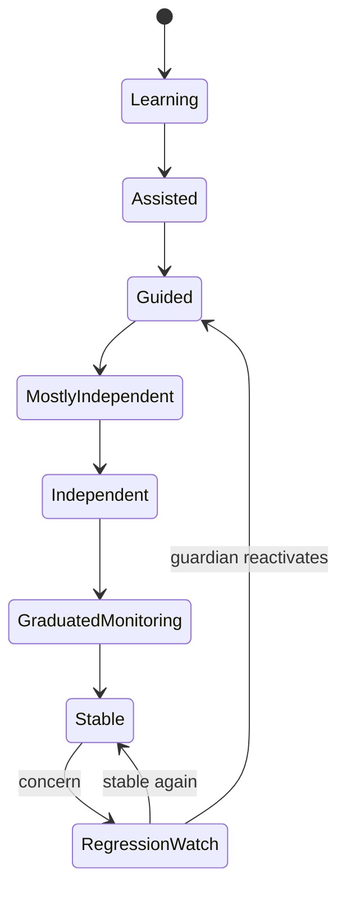

*Figure: Responsibility development from learning to stable graduation*

Graduation is a success state. When a routine is reliably independent, it leaves the child's active gamified journey and moves into **Graduated Monitoring** for the parent. The child may see it positively under **I Manage These Myself**.

## 3.10 Growth and XP

XP represents **effort and mastery**, not moral worth or money. XP should normally be skill-specific, such as Chess XP, Reading XP, or Math XP. A single huge universal life score is intentionally avoided because it would encourage optimization for points rather than capability.

Core XP rules introduced in V0.1 and refined later:

- no negative XP as punishment;
- no XP-to-money conversion;
- no sibling XP leaderboard;
- no values/faith XP;
- no unlimited farming of one scheduled activity;
- rewards should not permanently attach XP to responsibilities that should become habits.

## 3.11 Jobs and money

A Job teaches a real economic pattern:

`Opportunity -> Commitment -> Work -> Quality/Approval -> Income`

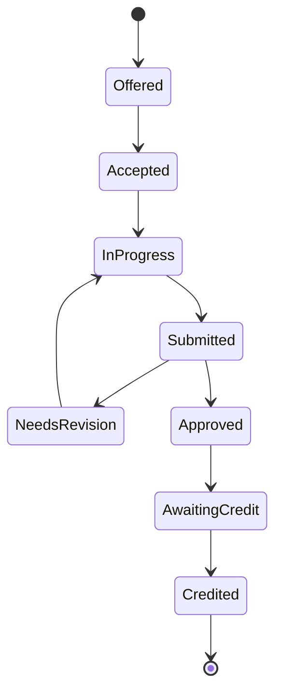

*Figure: Paid Job lifecycle, including revision and credit*

Money is a separate domain with a ledger. The interface always presents allocation in the agreed order:

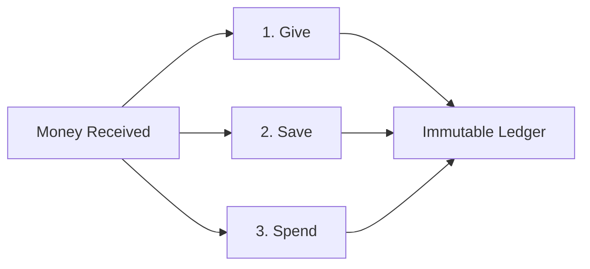

*Figure: Canonical money allocation order: Give, Save, Spend*

Recommended allocation percentages may exist as editable defaults, but the app should not force one universal percentage split.

## 3.12 Goals and Shared Goals

A goal is intentionally chosen progress toward a target. Goal types include personal, growth, saving, project, and shared family goals.

A **Shared Goal** belongs to the family, not one child. Example: prepare 20 books for donation. Malika may choose books, Eyad may organize them, a parent may pack them, and the family completes one common outcome. Contributions are not ranked.

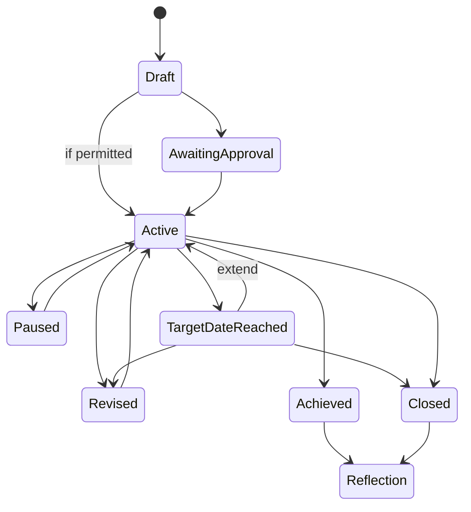

*Figure: Goal lifecycle, including pause, revision, target-date handling, and reflection*

## 3.13 Values and Moments

A **Moment** is a meaningful event worth preserving in the child's story. It may carry value tags such as Kindness, Honesty, Generosity, Courage, Patience, Perseverance, Family, or Initiative, but there is no numeric character score.

Presentation may vary by age:

- Explorer: illustrated visual scene;
- Builder: story card;
- Navigator/Launch: timeline or reflection entry.

The domain entity remains `Moment`; UI terms such as Memory, Story, or Highlight are presentation choices.

## 3.14 Weekly Review

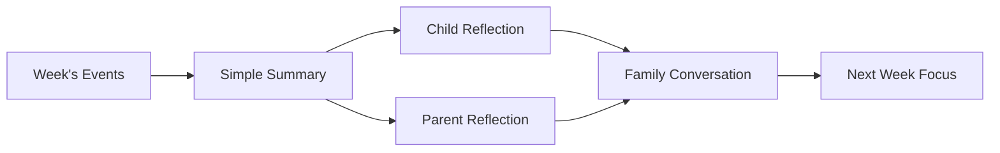

*Figure: Weekly review combines system context with human family conversation*

Core prompts:

- What are you proud of?
- What was difficult?
- What did you learn?
- Did you help someone?
- What would you like to improve?
- What is one focus for next week?

The application provides context; the meaning is created through real family conversation.

---

# 4. V0.2 - Detailed Business Rules & Flows

V0.2 converts the domain model into operational behavior.

## 4.1 Completion modes

Supported modes:

1. **Child self-confirmation** - default for ordinary low-risk routines.
2. **Guardian confirmation** - where adult verification is appropriate.
3. **Child submits -> guardian approves** - default for paid jobs.
4. **Automatically measurable later** - reserved for future integrations.

The default philosophy is **trust, not surveillance**. Normal activities should not require photos or continuous proof.

## 4.2 Activity statuses

V0.2 originally identified Pending, Completed, Missed, Excused, Not Applicable, and Unreported. V0.4 refines this model by introducing **Awaiting Resolution** so a missing record is not automatically treated as a miss. See V0.4 for the authoritative state model.

## 4.3 Reminder behavior

Reminders exist to support independence, not replace it. The system tracks:

- number of reminders;
- source: app, guardian, or child-created;
- whether completion occurred before or after external prompting.

A child-created reminder is evidence of planning, not dependency.

Default direction by age:

- **Explorer 6-8:** visual reminder, one gentle notification, guardian visibility.
- **Builder 9-12:** one scheduled reminder, child can configure reminders, less parent escalation.
- **Navigator 13-15:** child-created reminders preferred; parent escalation off by default.
- **Launch 16-17:** mostly self-managed.

Defaults are editable; they are not age locks.

## 4.4 Independence metrics

The system avoids a single responsibility score. Instead it exposes transparent signals:

- **Completion rate** = completed applicable instances / total applicable instances.
- **Self-initiation rate** = completions before external reminder / applicable instances.
- **Reminder dependency** = instances requiring external reminder / applicable instances.
- **Average reminders per opportunity.**
- **On-time rate** = on-time completions / completed instances.

These signals are used to explain suggestions rather than to label a child's personality.

## 4.5 Recovery

Recovery is deliberately more important than a perfect streak.

If an activity is missed and the child completes the **next valid opportunity**, recovery latency is one opportunity, regardless of the number of calendar days between opportunities.

Recommended visual hierarchy:

1. consistency;
2. recovery;
3. current streak;
4. best streak.

Recovery receives recognition, but **no bonus XP**, because rewarding recovery with currency could create perverse incentives.

## 4.6 Autonomy model

Autonomy is **domain-specific**. A child can be self-managed in morning routines and still parent-guided in spending.

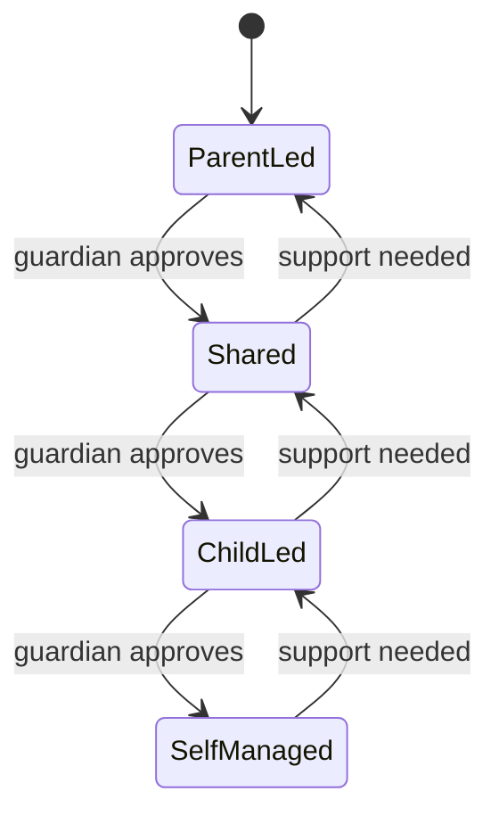

*Figure: Autonomy levels are capability-specific and guardian-approved*

Autonomy states:

- **Parent-led:** parent decides; child executes.
- **Shared:** parent and child decide together.
- **Child-led:** child plans/decides; parent can review.
- **Self-managed:** child operates independently; guardian mainly sees outcomes/trends.

Readiness signals may include:

- independence rate;
- reminder dependency;
- consistency;
- recovery after misses;
- goal follow-through;
- self-initiated behavior;
- quality/approval history;
- time sustained at the current autonomy level;
- domain-specific financial signals where relevant.

The system creates an **explainable suggestion**. A guardian must approve, postpone, or reject it. Thresholds are product defaults to validate, not scientific laws.

## 4.7 Graduation and regression

Graduation requires sustained independence and adequate recent evidence. It is guardian-approved.

After graduation:

- daily gamified prompts stop;
- active XP loops stop;
- the child can see the routine under **I Manage These Myself**;
- the guardian sees it under **Graduated Responsibilities**;
- periodic lightweight monitoring replaces daily tracking.

Regression is evidence-based. One poor observation may create a watch state; repeated evidence may generate a **reactivation suggestion**. Reactivation is never automatic.

## 4.8 Pause and legitimate exceptions

Pause windows cover illness, travel, exams, vacations, emergencies, or major schedule changes. Covered activity instances become **Excused** and do not:

- break streaks;
- reduce consistency;
- create recovery events;
- reduce autonomy evidence.

## 4.9 XP Engine

XP is deliberately simple in the MVP. Example template values may be small/normal/deep practice values such as 5/10/20 XP, but exact numbers are product defaults to tune later.

Rules:

- skill-specific XP preferred;
- no negative XP punishment;
- no XP-to-money conversion;
- no buying XP;
- no sibling leaderboard;
- no values/faith XP;
- no recovery XP bonus;
- no repeated farming of one scheduled opportunity.

## 4.10 Goal Engine

Every meaningful goal should ideally include:

- What?
- Why?
- Target.
- Current progress.
- Optional target date.
- Who chose it?
- Next step.

A target date reaching zero does not mean failure. The child can extend, revise, continue without a deadline, or close and reflect.

## 4.11 Money Engine

Wallet semantics:

- wallet represents money recognized as belonging to the child;
- it is initially a **ledger**, not a bank account;
- income sources may include paid job, allowance, gift, or guardian adjustment;
- money allocation presentation order is **Give -> Save -> Spend**;
- allocation defaults may be suggested but are editable according to autonomy;
- transaction history is append-only: corrections are new transactions, not deletions.

## 4.12 Consequences

Consequences are a separate domain from XP and money. The app should support family rules with explanations and logical consequence plans.

Example: `Tablet returns to charger at 20:00 because sleep matters. If it is not returned, tablet availability may be reduced the next day.`

Hard rule: bad behavior does **not** remove historical XP or money. Where appropriate, the system can support a **repair action** directly connected to the real-world effect.

## 4.13 Analytics

Analytics consume domain events and report behavior, not personality. MVP parent analytics:

1. consistency;
2. independence;
3. reminder dependency;
4. recovery;
5. goal progress/completion;
6. money allocation trends.

Examples of acceptable claims:

- independent completion increased from 42% to 71%;
- external reminders decreased;
- next-opportunity recovery improved;
- saving toward chosen goals increased.

Unacceptable outputs:

- responsibility score 76;
- generosity score 62;
- "impulsive child" based on one spending pattern.

## 4.14 Domain events and interpretation

The system stores facts such as `ActivityCompleted`, `ReminderIssued`, `GoalAchieved`, `JobCredited`, `MoneySaved`, `MomentRecorded`, `ResponsibilityGraduated`, and `RegressionObserved`. Derived progress and visuals are calculated from those facts.

---

# 5. V0.3 - Use Cases, Permissions & MVP Boundary

V0.3 makes the model implementable by defining actors, authorization, defaults/templates, screens, commands/events, MVP scope, and acceptance criteria.

## 5.1 Authorization model

Security principle: **deny by default + least privilege**.

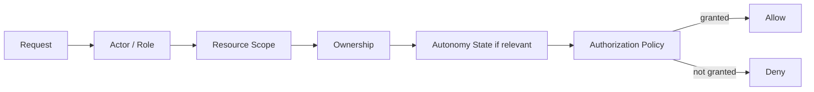

*Figure: Authorization evaluates role, scope, ownership, and autonomy*

Authorization depends on:

- actor role;
- family membership;
- resource scope;
- ownership;
- autonomy state where the operation is delegable.

Hiding a button in the UI is not authorization. The server/domain boundary must reject unauthorized forged requests.

### Permission matrix

| Action | Owner | Guardian | Child - own | Sibling |
|---|---:|---:|---:|---:|
| View child dashboard | Yes | Yes | Yes | No |
| Complete own activity | Optional | Optional | Yes | No |
| Edit activity rules | Yes | Yes | No | No |
| Create personal goal | Yes | Yes | Depends on autonomy | No |
| Edit own child-created goal | Yes | Yes | Yes if permitted | No |
| Create paid job | Yes | Yes | No | No |
| Accept own job | - | - | Yes | No |
| Approve job | Yes | Yes | No | No |
| View own wallet | Yes | Yes | Yes | No |
| Correct wallet | Yes | Yes | No | No |
| Allocate own money | Depends on autonomy | Depends | If permitted | No |
| Record Moment | Yes | Yes | If permitted | No/private by default |
| Approve autonomy | Yes | Yes | No | No |
| Approve graduation | Yes | Yes | No | No |
| Manage guardians | Yes | No | No | No |
| View family-shared goal/world | Yes | Yes | Yes | Yes |

## 5.2 Templates and defaults

A new `ActivityTemplate` domain concept supports low-friction setup. Templates include title, category, age range, default schedule, default policy, default "Why", and suggested progress type.

Important distinction:

- **Default:** recommended, editable, resettable.
- **Invariant:** a system law that cannot be overridden.

Example: Reading duration is a default. Enabling money for a Values activity violates an invariant.

## 5.3 Onboarding

Recommended onboarding:

1. Create account and family.
2. Add child name, birth date, avatar.
3. System derives age profile and recommended visualization/autonomy defaults.
4. Choose starter routine packs.
5. Configure basic money behavior/currency.
6. Choose weekly review day.
7. Start.

Do not ask for XP formulas, reminder thresholds, graduation thresholds, or advanced analytics during onboarding.

### Starter Packs

Suggested packs:

- Morning;
- School;
- Family Contribution;
- Reading;
- Chess;
- Money Basics.

A guardian can deselect individual activities before adding the pack.

## 5.4 Parent information architecture

Recommended parent navigation:

- **Home** - what needs attention now.
- **Children**
  - Overview
  - Responsibilities
  - Growth
  - Goals
  - Jobs
  - Money
  - Moments
  - Graduated
  - Insights
- **Family**
  - Family World
  - Shared Goals
  - Family Rules
- **Weekly Review**
- **Settings**

Parent Home should prioritize approvals, suggestions, anomalies, and relevant weekly trends - not a wall of analytics.

## 5.5 Child information architecture

Base child navigation:

- Today
- Journey
- Goals
- Money
- Story
- Family

Older child profiles can rename/rebalance areas toward Goals, Skills, Projects, Progress, and less childlike language without changing underlying domain objects.

## 5.6 Age-adaptive experience

Product experience bands:

| Age | Profile | Emphasis | Default visualization |
|---|---|---|---|
| 6-8 | Explorer | routines, concrete responsibility, immediate feedback | Immersive |
| 9-12 | Builder | planning, goals, skills, money habits, growing independence | Balanced |
| 13-15 | Navigator | autonomy, longer goals, reflection, decisions | Focused |
| 16-17 | Launch | real-life self-management, money, projects, adulthood preparation | Focused |

At 18, parent-managed mode should end by default. A future Personal Mode may allow a young adult to keep their history voluntarily.

### Visualization profiles

- **Immersive:** full world, characters, large illustrations, animated progress, icon-first navigation.
- **Balanced:** world + progress bars + skill trees + cards + moderate animation.
- **Focused:** mature graphics, dashboards, timelines, minimal animation, world optional/small.

Age chooses the **recommended default**. Parent/child preference chooses the actual experience. Motion is separate: Full, Reduced, Off.

## 5.7 Critical use cases

### Create Responsibility

Guardian selects a template. The system resolves defaults from activity category, age profile, and current stage. Guardian can change editable defaults. Policy validation blocks prohibited configurations.

### Complete Activity

Child completes; system records context (time, reminders, reporter, self-initiation), applies policy, updates semantic progress, creates events, and produces age-appropriate visual feedback.

### Recovery

A confirmed miss opens a recovery opportunity. Completing the next relevant opportunity updates recovery metrics and produces recognition without bonus XP.

### Job -> Money

Guardian creates paid job -> child accepts -> works -> submits -> guardian approves -> wallet is credited -> child allocates money in Give/Save/Spend order.

### Graduation

System evaluates evidence -> creates explained suggestion -> guardian approves -> active gamification is removed -> child sees "I Manage These Myself" -> guardian sees Graduated Monitoring.

### Personal Goal

Child/guardian defines What, Why, Target, and Next Step. Approval depends on autonomy. The goal may be revised or closed without being labeled a moral failure.

### Shared Goal

Family works toward one outcome. Contributions can differ by age and role. Progress is shared; no contribution ranking.

### Moment

Guardian or permitted child records a meaningful event with optional value tags. It can appear in the story/world but produces no XP, money, or character score.

## 5.8 Suggestions

Generic `Suggestion` types in MVP:

- Autonomy Increase;
- Graduation;
- Reactivation;
- Reduce Reminders.

Each suggestion stores an evidence snapshot and supports Pending, Accepted, Declined, and Snoozed states. Every important suggestion must answer:

- What is being suggested?
- Why?
- What evidence supports it?
- What changes if accepted?

## 5.9 Commands and events

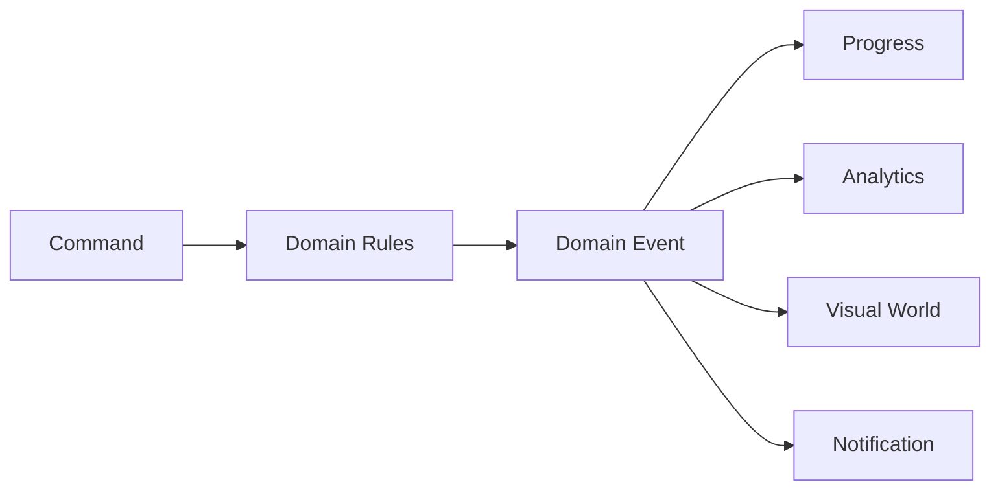

*Figure: Commands request change; domain rules emit facts; downstream systems react*

### Activity commands

`CreateActivity`, `UpdateActivity`, `ArchiveActivity`, `CompleteActivity`, `ExcuseActivity`, `RecordOfflineCompletion`, `PauseActivity`, `ResumeActivity`.

Events include `ActivityCreated`, `ActivityUpdated`, `ActivityArchived`, `ActivityCompleted`, `ActivityMissed`, `ActivityExcused`, `ActivityPaused`, `ActivityResumed`, `ReminderIssued`.

### Goal commands

`CreateGoal`, `ActivateGoal`, `UpdateGoal`, `PauseGoal`, `ResumeGoal`, `CloseGoal`, `CompleteGoal`.

### Job commands

`CreateJob`, `AcceptJob`, `SubmitJob`, `RequestJobRevision`, `ApproveJob`, `CreditJob`.

### Money commands

`CreditMoney`, `AllocateMoney`, `RecordSpend`, `RecordGiving`, `TransferToSavingGoal`, `CorrectTransaction`.

There is intentionally no `DeleteTransaction` command.

### Autonomy / graduation commands

`ReviewAutonomySuggestion`, `ApproveAutonomyChange`, `DeclineAutonomyChange`, `ApproveGraduation`, `DeclineGraduation`, `RecordGraduatedObservation`, `ReactivateResponsibility`.

### Moment commands

`RecordMoment`, `EditMoment`, `ArchiveMoment`.

There is intentionally no `AwardKindnessPoints` command.

## 5.10 MVP boundary

The MVP exists to validate behavior, not to maximize features.

### Must have

- Family, owner, guardian, child profiles.
- Age profiles and experience preferences.
- Templates and recurring responsibilities/growth activities.
- Completion, reminders, pause/excuse/archive.
- Consistency, independence, reminder dependency, recovery.
- Basic skill XP and simple milestones.
- Personal/growth goals and shared family goals.
- Paid jobs and guardian approval.
- Wallet ledger, Give/Save/Spend, saving goals.
- Moments and value tags.
- Graduation suggestion, monitoring, regression/reactivation suggestion.
- One Family World theme.
- Weekly Review.
- Basic parent insights.

### Explicitly not MVP

- AI parenting assistant;
- AI character analysis;
- AI-created punishments/consequences;
- social network or public profiles;
- sibling/global leaderboard;
- child-to-child messaging;
- school/teacher integration;
- real bank/payment integration;
- investment features;
- marketplace or reward store;
- complex virtual currency;
- wearables/location/camera/voice monitoring;
- advertising or subscriptions;
- community/multi-family social features.

## 5.11 Product success metrics

The product should not optimize for Daily Active Users. Better success indicators include:

- external reminders decrease;
- responsibilities graduate and remain stable;
- recovery improves;
- children create more appropriate goals themselves;
- parent configuration/intervention decreases where readiness supports it;
- money is allocated intentionally;
- family contribution continues without transactional rewards.

Candidate north-star product metric: **Sustained Independent Behaviors** - behaviors that move from guided -> independent -> graduated -> stable.

---

# 6. V0.4 - State, Edge Cases & Failure Modes

V0.4 defines what happens when real life is messy.

## 6.1 Absence of data is not failure

Authoritative rule:

> **No record does not mean the child failed.**

A scheduled opportunity that ends with no report becomes **Awaiting Resolution**, not automatically Missed.

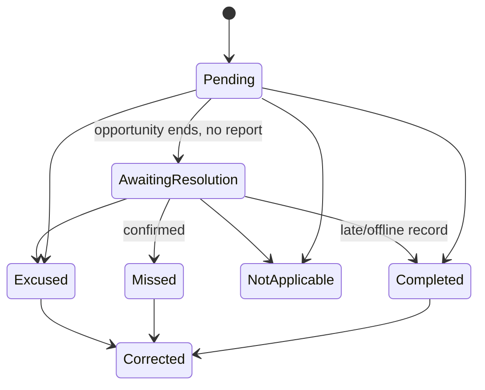

*Figure: Authoritative ActivityInstance state model after V0.4*

Definitions:

- **Awaiting Resolution:** the system does not know what happened.
- **Missed:** a human-confirmed non-completion.
- **Excused:** not expected to count due to legitimate exception.
- **Not Applicable:** the opportunity should not apply in this case.
- **Corrected:** history was amended through an auditable correction.

Only confirmed misses participate in recovery calculations.

## 6.2 Data Coverage and evidence confidence

Because missing data is uncertainty, parent analytics include **Data Coverage**. Low coverage prevents strong autonomy/graduation claims.

A suggestion requires:

- enough observations;
- enough recent data coverage;
- meaningful consistency/independence/recovery evidence;
- a minimum observation period/opportunity count.

If confidence is insufficient, the system keeps observing rather than fabricating certainty.

## 6.3 Corrections are not punishment

Accidental completion can be undone. Historical facts remain auditable, and derived XP/progress may be recalculated. A mistakenly granted XP amount may be reversed **as a correction**, never as punishment.

Repeated inaccurate self-reporting may cause a parent to temporarily change completion mode from self-confirmation to guardian confirmation. The system does not assign a dishonesty score.

## 6.4 Concurrency and stale guardian edits

The system must not silently use last-write-wins for meaningful configuration. If two guardians edit the same version, a stale save is rejected and the second guardian is asked to review the newer configuration.

Different domains use different conflict strategies:

| Domain | Conflict strategy |
|---|---|
| Activity completion | Merge/idempotent validation against the opportunity |
| Configuration | Reject stale edit; require review |
| Money | Immutable ledger + correction transaction |
| Goal progress | Merge valid events |
| Autonomy decision | Explicit authorized decision |
| Moment edit | Current version + history |
| Display preference | Latest preference is usually acceptable |

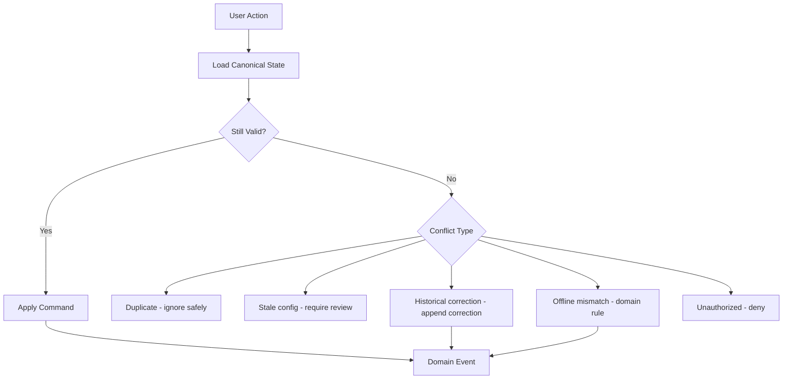

*Figure: Conflict handling is domain-specific, not blind last-write-wins*

## 6.5 Offline operation

The PWA must support core actions during intermittent connectivity. Offline commands are stored locally, synced later, and validated against canonical domain state. Automatic Background Sync may be used where supported, but the product cannot rely on that single browser feature.

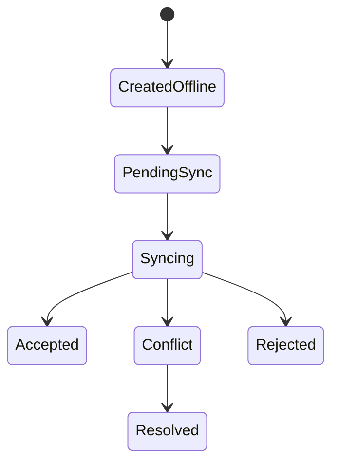

*Figure: Offline command synchronization lifecycle*

Important rules:

- retain the actual `occurredAt` time when later synced;
- do not award duplicate XP/money if the same command is retried;
- validate the state effective when the action occurred;
- if an activity was archived while a device was offline, a completion before archive may be valid while one after archive should not create progress;
- local devices suppress their own reminders after local completion, while cross-device uncertainty is represented honestly as unreported.

## 6.6 Opportunity windows

A recurring activity instance has:

- `availableFrom`;
- `targetAt`;
- `opportunityEndsAt`.

This distinguishes on-time, late-but-valid, and unreported/missed behavior without turning one timestamp into a punishment mechanism.

Activities crossing midnight belong to the opportunity window that created them, not necessarily the calendar date of completion.

## 6.7 Schedule edits and history

- A newly created morning activity added after today's window starts on the next valid occurrence by default.
- Editing a recurring schedule affects future instances by default.
- The parent may explicitly apply a change to today's pending instance.
- Past instances never change retroactively.
- Timezone changes affect future interpretation; history remains fixed.

## 6.8 Pause windows

Illness, travel, exams, vacation, emergency, and other legitimate exceptions use Pause Windows. Covered activities become Excused and do not damage streaks, consistency, recovery, or autonomy evidence.

## 6.9 Partial jobs and fairness

A partially completed job defaults to **Needs Revision**, not automatic partial payment. Completion criteria should be visible when the job is accepted.

Fairness invariant:

> Once a child accepts a paid job at an agreed payment, the parent cannot silently reduce the payment afterward.

If scope/payment must change, revised terms are proposed and acknowledged. If a parent cancels after substantial work has begun, optional partial compensation may be recorded by the guardian.

Job states distinguish **Approved**, **Awaiting Credit**, and **Credited**. This allows the app to show money owed to the child without pretending it has already been added to the wallet ledger.

## 6.10 Wallet and external reality

Wallet represents ownership, not necessarily cash custody. A child may own money held physically by the parent.

For MVP, physical custody is not fully modeled. Later extensions may distinguish cash, parent-held, or bank account balances.

External real-world actions:

- cash spending can be recorded later;
- giving outside the app reduces the wallet once recorded;
- gift income enters as Gift and can still be allocated Give/Save/Spend;
- cancelled saving goals return their saved amount to the general Save bucket rather than Spend;
- negative child balance is not allowed by default;
- reconciliation uses correction transactions, not deletion.

## 6.11 Goal edge cases

- Target date reached does not equal failure.
- Child may extend, revise, close and reflect, or continue without a deadline.
- Revised goal targets preserve historical versions.
- Closing a goal does not erase progress.
- Shared goals can accept late participants without resetting progress.
- Shared contributions are never turned into percentages that rank siblings.

## 6.12 Non-monetary rewards

V0.4 adds an explicit `MilestoneReward` concept because the original product vision included meaningful non-cash celebration.

Allowed types:

- Privilege;
- Experience;
- Tangible;
- Symbolic.

Examples: choose the family movie, choose Friday dinner, extra weekend game time, special outing with a parent, small gift, visual unlock.

Rewards attach primarily to **milestones**, not every action. Values and Faith cannot enter a redeemable reward economy. No universal reward shop belongs in the MVP.

## 6.13 Moment corrections

Draft Moments can be deleted. Published Moments are archived/corrected so their history remains parent-auditable. Visual effects may be reversed/recomputed, but there is no morality score to recalculate.

## 6.14 Graduation evidence freshness

Old success alone cannot trigger graduation. If recent data is insufficient, the system says so. Similarly, missing post-graduation check-ins produce **monitoring overdue**, not "regression detected".

One poor post-graduation observation may create watch status; repeated evidence may create a reactivation suggestion.

## 6.15 Age-profile transitions

Crossing an age band offers **new recommended defaults**, not an automatic UI reset or authority change.

The system must not automatically:

- change autonomy;
- reset visualization preference;
- rewrite existing responsibilities;
- reset progress;
- force a new interface profile.

Age is advisory; readiness and preference remain separate.

## 6.16 Child non-use and tracking mode

A child refusing or ceasing to use the app is not itself a behavior failure. The family can move among tracking modes:

- Child Self-Tracking;
- Shared Tracking;
- Parent Observation;
- Light Monitoring.

If independent real-world behavior improves while app usage falls, that may be **success**. The product must not optimize child development around screen engagement.

## 6.17 Shared devices

A shared tablet requires explicit profile switching. Parent mode must require guardian authentication or PIN; merely tapping a profile must not grant privileged operations.

Child profiles must not leak siblings' private wallets, goals, or personal history. Family-shared resources remain visible according to policy.

## 6.18 OccurredAt vs RecordedAt

Many records need two times:

- `occurredAt`: when the real event happened;
- `recordedAt`: when the app learned about it.

Example: a guardian can backfill yesterday's completion today. Analytics use the occurrence time; audit history uses the record time.

## 6.19 Historical mutation rules

- child self-correction can have a limited default window;
- older activity corrections require guardian authorization;
- child cannot directly edit historical money transactions;
- unused draft activities may be hard-deleted;
- activities with history are archived;
- deactivating a child profile is preferred over instant destructive deletion in the family pilot;
- parent approval delays never count against child performance.

## 6.20 Notifications are convenience, not truth

A failed push notification does not mean a reminder was ignored. Where possible distinguish scheduled, attempted, delivered, and acknowledged reminders. Never infer acknowledgement without evidence.

## 6.21 Multiple devices and idempotency

Completing the same instance on two devices must result in **one semantic completion**, not duplicate XP or duplicate money. State-changing commands need unique identities so retries are safe.

## 6.22 Correction vs consequence

- **Correction:** the data was wrong.
- **Consequence:** the real behavior occurred and a related real-world outcome follows.

Consequences never rewrite historical XP, achievements, or money. Family rule changes apply prospectively, not retroactively.

## 6.23 Reward promise integrity

If a guardian creates a reward after a milestone was already achieved, they must explicitly choose whether it applies retroactively or begins with the next milestone.

If a promised reward cannot be fulfilled, it is not silently deleted. Reward states may include Promised, Fulfilled, Replaced by Agreement, and Cancelled with Explanation.

## 6.24 Complete truth model

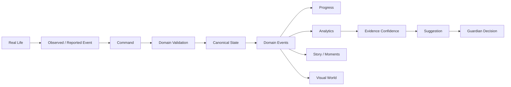

*Figure: Real life is observed, validated, stored as canonical truth, interpreted, and only then visualized or suggested upon*

The design deliberately prevents analytics or visuals from pretending to be reality. Suggestions remain subordinate to guardian judgment.

---

# 7. Consolidated Domain Invariants

The following should eventually become automated domain tests, not just documentation.

## 7.1 Rewards and meaning

- XP cannot become money.
- Money cannot purchase XP.
- Values cannot generate XP.
- Values cannot generate money.
- Faith cannot generate money.
- Faith does not generate XP by default.
- Normal family responsibility cannot generate money.
- Paid work must use the Job domain.
- Money cannot represent moral value.
- Recovery recognition does not grant bonus XP merely for recovery.
- Non-monetary rewards attach to milestones, not routine moral behavior.
- Values and Faith cannot participate in a redeemable reward economy.

## 7.2 Historical integrity

- No negative XP as punishment.
- Erroneous XP may be reversed only through auditable correction.
- Missed activities do not erase previously earned XP/progress.
- Broken streaks do not erase history.
- Unknown/unreported status is not failure.
- Excused activities do not reduce consistency.
- Historical activity instances are preserved.
- Financial records are append-only.
- Activity configuration changes are prospective by default.
- Family rule changes are prospective by default.

## 7.3 Human authority and autonomy

- Age sets defaults but does not determine autonomy.
- Autonomy changes require authorized guardian approval.
- Graduation requires guardian approval.
- Reactivation after regression requires guardian approval.
- The system measures, explains, and suggests; it does not silently transfer parenting authority.
- Children gain control by domain; autonomy is not one global child level.

## 7.4 Fairness and privacy

- No sibling leaderboard.
- No morality score.
- Sibling private resources are inaccessible unless explicitly family-shared.
- Accepted job terms cannot be silently reduced afterward.
- Parent delays do not count as child failure.
- No data does not become a negative behavioral judgment.

## 7.5 Visualization

- Visual themes cannot alter business logic.
- Visualization level and motion level are separate.
- Age determines a recommended visualization, not a locked one.
- Every meaningful action should leave an appropriate visible trace, but not necessarily XP.

## 7.6 Product philosophy

- App engagement itself is not a child-development success metric.
- Reduced app use alongside stable independence can be success.
- Every configurable option has a recommended default and a reset-to-recommended path.
- Every mechanic should have an explicit learning purpose.

---

# 8. MVP Scope

## 8.1 MVP objective

Run an 8-12 week family pilot capable of answering:

- Do external reminders decrease?
- Do responsibilities become independent and graduate?
- Does recovery improve after missed opportunities?
- Do children begin choosing appropriate goals themselves?
- Does money behavior become more intentional?
- Do family contributions persist without becoming transactional?
- Does visual progress motivate without turning everything into a currency?

## 8.2 MVP feature set

### Family / Identity

- one family;
- owner + guardians;
- child profiles;
- age profiles;
- visualization + motion preferences;
- shared-device profile switching.

### Activities / Progress

- templates and starter packs;
- self and family responsibilities;
- growth activities;
- recurring schedules and opportunity windows;
- completion, correction, pause, excuse, archive;
- reminders;
- consistency, independence, reminder dependency, recovery, data coverage;
- basic skill XP and milestones.

### Goals

- personal/growth goals;
- saving goals;
- shared family goals;
- revisions, pause, close, reflection.

### Jobs / Money

- paid jobs;
- terms and completion criteria;
- submission/revision/approval/credit;
- wallet ledger;
- Give, Save, Spend;
- saving goals;
- gift/allowance/adjustment income;
- corrections.

### Values / Family

- Moments;
- value tags;
- personal story/timeline;
- one Family World theme;
- one shared-goal experience;
- milestone rewards limited to simple privilege/experience/tangible/symbolic types.

### Independence

- autonomy evidence and suggestions;
- guardian approval;
- graduation suggestions;
- Graduated Monitoring;
- regression observations and reactivation suggestions;
- tracking modes.

### Review / Insights

- Weekly Review;
- parent attention dashboard;
- six core metrics plus Data Coverage;
- explainable suggestions.

## 8.3 Deferred features

Defer AI analysis, public/social features, bank integrations, advertising, subscriptions, wearables, location/camera/voice monitoring, reward marketplace, complex virtual currencies, and advanced multi-family/community functionality until the family pilot validates the core model.

---

# 9. Open Decisions for System Architecture V1.0

The Product + Domain design is sufficiently stable to choose technology next. Architecture should be evaluated against these concrete requirements:

## 9.1 Frontend / PWA

- installable PWA;
- age-adaptive UI;
- one codebase for parent/child experiences where practical;
- reliable local/offline state for core actions;
- accessible motion reduction;
- theme-independent semantic visual model.

## 9.2 Authentication and authorization

- family owner, guardian, child profiles;
- secure guardian mode on shared devices;
- child-friendly sign-in/profile switching;
- server-enforced least privilege;
- ownership + role + autonomy-aware authorization.

## 9.3 Backend and persistence

- recurring activity generation;
- immutable/auditable money ledger;
- auditable corrections;
- commands/events with idempotency;
- optimistic concurrency/version checking for configuration;
- scheduled reminders/review jobs;
- efficient analytics over event history.

## 9.4 Offline and synchronization

- local pending command queue;
- occurredAt versus recordedAt;
- idempotent retries;
- domain-specific conflict handling;
- no dependence on Background Sync as the only synchronization mechanism.

## 9.5 Notifications

- child reminders;
- guardian approval queue;
- weekly review reminder;
- autonomy/graduation/regression suggestions;
- delivery failures must not become behavioral facts.

## 9.6 Analytics

- derived metrics can be recomputed from reliable history;
- Data Coverage and evidence freshness;
- no composite morality/child score;
- explainable evidence snapshots for suggestions.

## 9.7 Cloud / cost

Initial architecture should strongly favor free or near-free managed services for the family pilot while preserving a reasonable migration path if the product later becomes commercial.

## 9.8 Testing

Architecture must make it practical to test domain invariants independently of the UI. High-value automated tests include:

- prohibited money/XP configurations;
- no duplicate job credit;
- no duplicate XP on retries;
- stale guardian edit rejection;
- correction versus punishment semantics;
- graduation/autonomy never automatic;
- unreported never automatically becomes Missed;
- sibling resource isolation;
- visual preference never changes domain state.

---

# 10. References

These sources informed the behavioral and product principles. They do not define the application's exact thresholds; thresholds such as observation windows and readiness percentages remain product defaults that must be validated through use.

1. **Harvard Center on the Developing Child - Executive Function & Self-Regulation**  
   https://developingchild.harvard.edu/key_concepts/executive_function/

2. **Harvard Center on the Developing Child - Activities Guide: Enhancing and Practicing Executive Function Skills**  
   https://developingchild.harvard.edu/resources/handouts-tools/activities-guide-enhancing-and-practicing-executive-function-skills/

3. **Consumer Financial Protection Bureau - Money as You Grow (School-age children and preteens)**  
   https://www.consumerfinance.gov/consumer-tools/money-as-you-grow/school-age-children-preteens/

4. **CFPB - Youth Financial Education / Financial Habits and Norms**  
   https://www.consumerfinance.gov/consumer-tools/educator-tools/youth-financial-education/

5. **UNICEF Egypt - Parenting Hub / Raising Younger Children**  
   https://www.unicef.org/egypt/parenting-hub  
   https://www.unicef.org/egypt/raising-younger-children

6. **UNICEF - Parenting Adolescents guidance**  
   https://www.unicef.org/documents/parenting-adolescents-programming-guidance

7. **Self-Determination Theory - Intrinsic Motivation and Application**  
   https://selfdeterminationtheory.org/the-theory/  
   https://selfdeterminationtheory.org/topics/application-intrinsic-motivation/

8. **OWASP - Authorization Cheat Sheet**  
   https://cheatsheetseries.owasp.org/cheatsheets/Authorization_Cheat_Sheet.html

9. **OWASP - Authorization Patterns Cheat Sheet**  
   https://cheatsheetseries.owasp.org/cheatsheets/Authorization_Patterns_Cheat_Sheet.html

10. **MDN - Offline and Background Operation for PWAs**  
    https://developer.mozilla.org/en-US/docs/Web/Progressive_web_apps/Guides/Offline_and_background_operation

11. **OMG - UML 2.5.1 Specification**  
    https://www.omg.org/spec/UML/2.5.1

12. **Microsoft - Domain-driven design and domain modeling guidance**  
    https://learn.microsoft.com/dotnet/architecture/microservices/microservice-ddd-cqrs-patterns/microservice-domain-model

---

# Appendix A - Quick Decision Reference

| Question | Decision |
|---|---|
| Does every task give XP? | No. Progress is broader than XP. |
| Can family chores pay money? | Ordinary responsibilities: no. Extra Work: yes. |
| Can kindness earn XP? | No. Record a Moment / visual impact instead. |
| Can prayer/faith earn XP or money? | No by default. Use meaning/journey/reflection. |
| Who grants autonomy? | Guardian. System only suggests with evidence. |
| What happens after graduation? | Leaves active gamification, remains in guardian monitoring and child's "I Manage These Myself". |
| What happens when a streak breaks? | History remains; Recovery becomes important. |
| What if there is no activity record? | Awaiting Resolution, not automatic Missed. |
| What if the child stops using the app? | Change tracking mode; no app-use punishment. |
| Can siblings compare scores? | No sibling leaderboard. |
| Can a guardian edit history? | Through auditable correction, not destructive rewrite. |
| Can money transactions be deleted? | No; append correction/reversal. |
| Can visuals be changed? | Yes; visuals are separate from domain truth. |
| What is the default money order? | Give -> Save -> Spend. |
| What age is supported? | 6-17 parent-managed; initial pilot 7 and 11. |
| What happens at 18? | Parent-managed mode ends by default; Personal Mode is future scope. |

# Appendix B - Glossary

**Activity Definition** - reusable description of an activity and its meaning.  
**Activity Assignment** - child-specific schedule and policy for an activity.  
**Activity Instance** - one real scheduled opportunity.  
**Activity Policy** - allowed progress/reward/approval/graduation behavior.  
**Autonomy Domain** - a capability area with its own autonomy state.  
**Data Coverage** - how much recent expected behavior is actually known.  
**Domain Event** - an immutable fact that something happened.  
**Graduation** - removal of active gamification after sustained independence, while retaining monitoring/history.  
**Job** - optional paid work with explicit terms and completion criteria.  
**Moment** - meaningful values/identity event preserved without a score.  
**Opportunity Window** - time range in which one scheduled activity instance can validly occur.  
**Progress Track** - semantic progress such as consistency, independence, mastery, financial, goal, or family progress.  
**Recovery** - return to the behavior after a confirmed missed opportunity.  
**Shared Goal** - one family-owned outcome with collaborative, non-ranked contributions.  
**Suggestion** - explainable system recommendation requiring authorized human decision where authority changes.  
**Tracking Mode** - how behavior is recorded: Child Self-Tracking, Shared Tracking, Parent Observation, or Light Monitoring.  
**Visual World** - presentation of semantic progress; never the source of business truth.